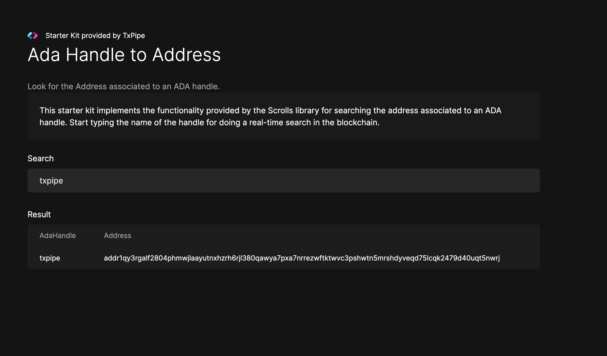

# ADA Handle Starter Kit

This starter kit shows how to query the [Scroll](https://github.com/txpipe/scrolls) instance provided by [Demeter.run](https://demeter.run) to fetch the address associated to an ADA Handle.

## Dev Environment

For running this starter kit you'll need access to a Scrolls instance running the ADA Handle Reducer.

In case you don't want to install the required components yourself, you can use [Demeter.run](https://demeter.run) platform to create a cloud environment with access to common Cardano infrastructure. The following command will open this repo in a private, web-based VSCode IDE with access to a running Scrolls instance.

[](https://demeter.run/code?repository=https://github.com/txpipe/ada-handle-scrolls-starter-kit&template=typescript)


### Building & Running the Application

This Starter Kit is implemented as a [Remix App](https://remix.run/). 

From the web-based workspace open a new Terminal and run the following commands:

```bash
# Install dependencies
$ npm install

# build the application
$ npm run build

# start the application
npm run dev
```

Your application should be now running in localhost:3000

### Testing the Application

For testing the application in your web browser we need to expose the workspace port where the application is running. 

For doing this in the [Demeter.run](https://demeter.run) console go to your workspaces, select the workspace where you are running the starter kit and go to the Exposed Ports tab. 

From this tab you can select to expose a new port. 


Once your port is exposed you can click en the auto generated URL


It should open a new web browser tab where you can run and test the application




