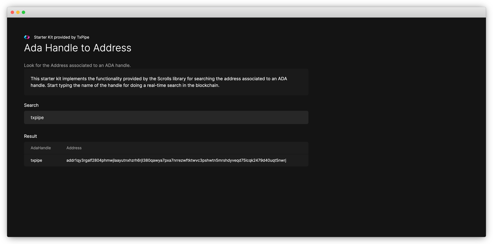

# ADA Handle Starter Kit

This starter kit shows how to build a simple application which queries the [Scrolls](https://github.com/txpipe/scrolls) instance provided by [Demeter.run](https://demeter.run) for fetching the address associated to an [ADA Handle](https://adahandle.com/).



## Dev Environment

For running this starter kit you'll need access to a [Scrolls](https://github.com/txpipe/scrolls) instance running the [ADA Handle Reducer](https://github.com/txpipe/scrolls/blob/main/src/reducers/address_by_ada_handle.rs).

In case you don't want to install the required components yourself, you can use [Demeter.run](https://demeter.run) platform to create a cloud environment with access to common Cardano infrastructure. The following command will open this repo in a private, web-based VSCode IDE with access to a running Scrolls instance.

[](https://demeter.run/code?repository=https://github.com/txpipe/ada-handle-scrolls-starter-kit&template=typescript)

### Implementation Details

This Starter Kit is implemented as a [Remix Application](https://remix.run/). Its composed of a simple front-end page where a user can type the name of the ADA Handle and it will query the backend in real-time for returning the address associated to the handle. 


The infrastructure provided by [Demeter.run](https://demeter.run) is making sure the redis instance has always the latest address value associated to the handle. For this purpose it provides us with a Scrolls instance running the ada-handle-reducer and sinking the information into a redis database so we can easily query it by key. 

For connecting to the redis instance we use the port exposed inside of demeter:
```typescript
const client = redis.createClient({
  url: "redis://kvrocks-mainnet-adahandle.ftr-scrolls-v0.svc.cluster.local:6666",
});
```

The redis instance is storing the the ADA handle as a key with a c. prefix. 

```bash
[
   'c.ada',             'c.ada-',            'c.ada--',
   'c.ada-.-whale',     'c.ada-1',           'c.ada-1111',
   'c.ada-2-the-moon',  'c.ada-4-ada',       'c.ada-4-life',
   'c.ada-4-live',      'c.ada-4-me',        'c.ada-4-nele',
   'c.ada-4-walter',    'c.ada-6666',        'c.ada-9999',
   'c.ada-_-whale',     'c.ada-accepted',    'c.ada-account.io',
   'c.ada-ada',         'c.ada-ada-ada',     'c.ada-address',
   'c.ada-addy',        'c.ada-air-defence', 'c.ada-all-day',
   'c.ada-ambassador',  'c.ada-and-cocain',  'c.ada-andrew',
   'c.ada-ant-man',     'c.ada-anvil',       'c.ada-anvil.io',
   'c.ada-ape',         'c.ada-apes',        'c.ada-apocalypse',
   'c.ada-army',        'c.ada-auction',     'c.ada-babe',
   'c.ada-baby-whale',  'c.ada-bag',         'c.ada-bagholder',
   'c.ada-baller',      'c.ada-ballz',       'c.ada-bank',
   'c.ada-billionaire', 'c.ada-boss',        'c.ada-bots',
   'c.ada-box',         'c.ada-boy',         'c.ada-boyz',
   'c.ada-brett',       'c.ada-bridge',      'c.ada-broke',
   'c.ada-broker',      'c.ada-bull',        'c.ada-burn',
   'c.ada-cardano',     'c.ada-cardano-',    'c.ada-chase',
   'c.ada-chris',       'c.ada-clay',        'c.ada-cnft',
   'c.ada-coin',        'c.ada-collector',   'c.ada-contracts',
   'c.ada-crappie',     'c.ada-crypto',      'c.ada-cryptoverse',
   'c.ada-dad',         'c.ada-dao',         'c.ada-dap.pay',
   'c.ada-dealer',      'c.ada-defi',        'c.ada-degen',
   'c.ada-demon',       'c.ada-deposit',     'c.ada-dolphin',
   'c.ada-donation',    'c.ada-donations',   'c.ada-drop',
   'c.ada-dude',        'c.ada-express',     'c.ada-family',
   'c.ada-farm',        'c.ada-fee',         'c.ada-fees',
   'c.ada-filthy',      'c.ada-for-ukraine', 'c.ada-freak',
   'c.ada-games',       'c.ada-gang',        'c.ada-geek',
   'c.ada-girl',        'c.ada-giveaway',    'c.ada-goat',
   'c.ada-god',         'c.ada-handle',      'c.ada-handle-',
   'c.ada-handle.',     'c.ada-handle.com',  'c.ada-handle.io',
   'c.ada-handles'
]
```

So for keeping this example simple, we are just querying keys which start with the prefix + the user provided input.

```typescript
const keys = (await client.sendCommand(["keys", `c.${name}*`])) as string[];
```

Then we just need to read the values from all keys returned before sending the information with the result back to the front-end. 

```typescript
const values = await client.mGet(keys);
```

### Building & Running the Application

From the web-based workspace open a new Terminal and run the following commands:

```bash
# Install dependencies
$ npm install

# build the application
$ npm run build

# start the application
npm run dev
```

Your application should be now running in localhost:3000

### Testing the Application

For testing the application in your web browser we need to expose the workspace port where the application is running. 

For doing this in the [Demeter.run](https://demeter.run) console go to your workspaces, select the workspace where you are running the starter kit and go to the Exposed Ports tab. 

From this tab you can select to expose a new port. 


Once your port is exposed you can click en the auto generated URL and it should open a new browser tab with your application running.


